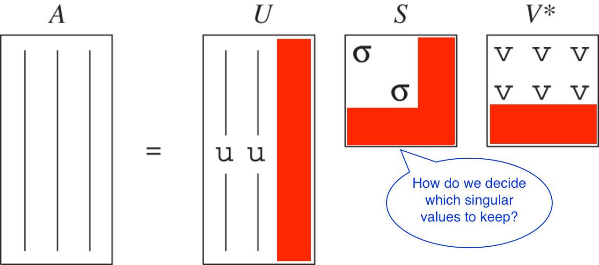
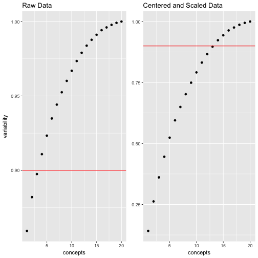
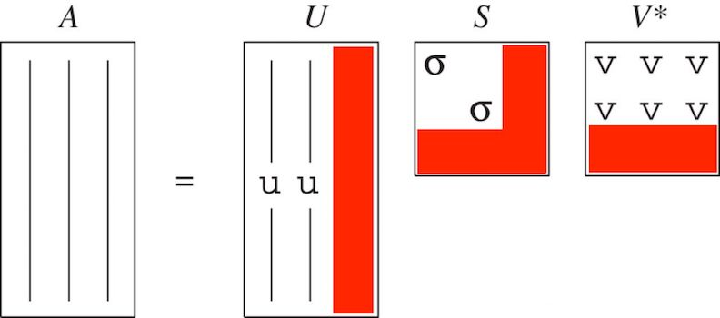

<style>
.small-code pre code {
  font-size: 1em;
}
</style>

SVD: Dimension Retension
========================================================
author: CUNY - DATA 643: Recommender Systems
date: Walt Wells, Summer 2017
autosize: true
transition: rotate
transition-speed: slow

SVD:  What should we retain?
========================================================


* Different methods for different purposes.  
* Our focus: dimension reduction for RecSys. 

Retain 80-90% of the Variability
========================================================

We will use sum of squares technique to determine variability reduction.  A general rule of thumb is to keep 80-90% of the variability.  

$$\frac{\sum_{i=1}^{n} \sigma_i'^{2}}{\sum_{i=1}^{n} \sigma_i^{2}} \approx .90$$

NOTE: if we remove singular values and reconstruct our original Matrix M to be M' prime, and calculate variability, we get the same answer. 

$$\frac{\sum_{i=1}^{n} \sigma_i'^{2}}{\sum_{i=1}^{n} \sigma_i^{2}} = \frac{\sum_{i=1}^{n} M_i'^{2}}{\sum_{i=1}^{n} M_i^{2}} $$


Example: Generate Toy Data
========================================================
class: small-code


```r
set.seed(643)
n <- 40; m <- round(n/2, 0)
# generate data
toyDF <- as.data.frame(replicate(m, floor(runif(n, 1,6))))
# add some real bias
toyDF[,1:3] <- toyDF[,1:3] + 1; toyDF[,4:6] <- toyDF[,4:6] - 1
toyDF[1:3,] <- toyDF[1:3,] + 1; toyDF[4:6,] <- toyDF[4:6,] - 1
toyDF[toyDF > 5] <- 5; toyDF[toyDF < 1] <- 1
dim(toyDF)
```

```
[1] 40 20
```

```r
head(toyDF[1:8], 5)
```

```
  V1 V2 V3 V4 V5 V6 V7 V8
1  5  5  5  5  1  5  4  4
2  5  5  5  5  3  5  2  3
3  5  3  5  5  3  4  3  3
4  3  3  5  2  3  1  3  1
5  3  5  1  1  1  2  4  1
```

Example: Center and Scale Data
========================================================
class: small-code


```r
scaledToyDF <- data.frame(scale(toyDF, 
                                center=T, 
                                scale=T))
head(scaledToyDF[1:8], 5)
```

```
          V1         V2         V3         V4         V5         V6
1  0.8898194  1.1915915  0.8496424  1.8432099 -1.0006448  1.9462608
2  0.8898194  1.1915915  0.8496424  1.8432099  0.7025804  1.9462608
3  0.8898194 -0.4808176  0.8496424  1.8432099  0.7025804  1.1976989
4 -0.7280340 -0.4808176  0.8496424 -0.2835708  0.7025804 -1.0479866
5 -0.7280340  1.1915915 -2.1713083 -0.9924976 -1.0006448 -0.2994247
           V7          V8
1  0.86114897  0.79358975
2 -0.74098864  0.08817664
3  0.06008016  0.08817664
4  0.06008016 -1.32264958
5  0.86114897 -1.32264958
```

Example: Perform SVD, Compare
========================================================
class: small-code

<br>


```r
S <- diag(svd(toyDF)$d)
S[1:3, 1:3]
```

```
         [,1]     [,2]     [,3]
[1,] 88.39038  0.00000  0.00000
[2,]  0.00000 14.35887  0.00000
[3,]  0.00000  0.00000 11.87614
```

***

<br>


```r
S_Center_Scale <- diag(svd(scaledToyDF)$d)
S_Center_Scale[1:3, 1:3]
```

```
         [,1]     [,2]     [,3]
[1,] 10.50825 0.000000 0.000000
[2,]  0.00000 9.713093 0.000000
[3,]  0.00000 0.000000 8.769423
```

Helper Function: Create Variability Table
========================================================
class: small-code

Create a table showing "energy" or variability kept for keeping top n singular values or concepts. 


```r
SVD_DimReductionTable <- function(s) {
    df <- data.frame()
    for (i in seq(nrow(s))) {
        m <- sum(s[1:i, 1:i]^2)/sum(s^2)
        df <- rbind(df, c(i, m))
    }
    names(df) <- c("concepts", "variability")
    df
}

mytable <- SVD_DimReductionTable(S)
mytable_CS <- SVD_DimReductionTable(S_Center_Scale)
```

Example: Determine Retension Cutoff
========================================================
class: small-code
left: 60%



***

Raw Data

```
  concepts variability
1        1   0.8593113
2        2   0.8819881
3        3   0.8975009
4        4   0.9108730
5        5   0.9233403
6        6   0.9348872
```

Center and Scaled

```
  concepts variability
1        1   0.1415683
2        2   0.2625224
3        3   0.3611157
4        4   0.4458154
5        5   0.5239411
6        6   0.5948652
```


Summary
========================================================

* Can compare sum of squares of reduced $\Sigma$ and original $\Sigma$
* For RecSys, rule of thumb is to keep 80-90% of the variability
* Centering and scaling data changes the concept/variability relationship




References
========================================================

* [Mining of Massive Datasets, Anand Rajaraman and Jeffrey Ullman, Chapter 11.3](http://infolab.stanford.edu/~ullman/mmds/book.pdf)
* [SVD Gives the Best Low Rank Approximation (Advanced) | Stanford (VIDEO)](https://youtu.be/c7e-D2tmRE0?list=PLLssT5z_DsK9JDLcT8T62VtzwyW9LNepV)

