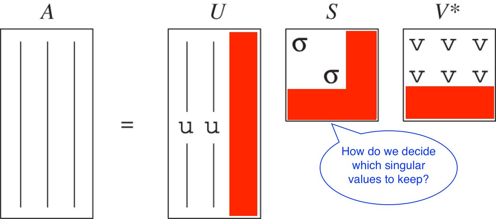

<style>
.small-code pre code {
  font-size: 1em;
}
</style>

SVD: Dimensionality Reduction
========================================================
author: CUNY DATA 643: Recommender Systems
date: Walt Wells, Summer 2017
autosize: true
transition: rotate
transition-speed: slow

SVD:  What to Keep? 
========================================================

<br>
<br>


SVD:  Retain 80-90% of the Variability
========================================================

We will use sum of squares technique to determine variability reduction.  A general rule of thumb is to keep 80-90% of the variability.  

$$\frac{||\Sigma'||^2}{||\Sigma||^2} \approx .90$$

NOTE: if we remove singular values and reconstruct our original Matrix M to be M' prime, and calculate variability, we get the same answer. 

$$\frac{||\Sigma'||^2}{||\Sigma||^2} = \frac{||M'||^2}{||M||^2} $$


Example 1: Generate Toy Data, Perform SVD
========================================================
class: small-code


```r
set.seed(643)
n <- 40; m <- round(n/2, 0)
# generate data
toyDF <- as.data.frame(replicate(m, floor(runif(n, 1,6))))
# add some real bias
toyDF[,1:3] <- toyDF[,1:3] + 1; toyDF[,4:6] <- toyDF[,4:6] - 1
toyDF[1:3,] <- toyDF[1:3,] + 1; toyDF[4:6,] <- toyDF[4:6,] - 1
toyDF[toyDF > 5] <- 5; toyDF[toyDF < 1] <- 1
head(toyDF[1:15], 5)
```

```
  V1 V2 V3 V4 V5 V6 V7 V8 V9 V10 V11 V12 V13 V14 V15
1  5  5  5  5  1  5  4  4  2   3   4   5   5   2   5
2  5  5  5  5  3  5  2  3  5   2   5   3   5   5   3
3  5  3  5  5  3  4  3  3  4   4   2   4   5   5   4
4  3  3  5  2  3  1  3  1  3   4   2   2   1   2   3
5  3  5  1  1  1  2  4  1  3   1   4   3   1   3   4
```

```r
toyDFsvd <- svd(toyDF)
S <- diag(toyDFsvd$d)
U <- toyDFsvd$u
V <- toyDFsvd$v
```


Helper Function: Create Variability Table
========================================================
class: small-code

Create a table showing "energy" or variability kept for keeping top n singular values or concepts. 


```r
SVD_DimReductionTable <- function(s) {
    df <- data.frame()
    for (i in seq(nrow(s))) {
        m <- sum(s[1:i, 1:i]^2)/sum(s^2)
        df <- rbind(df, c(i, m))
    }
    names(df) <- c("concepts", "variability")
    df
}

mytable <- SVD_DimReductionTable(S)
```

Example 1:  Toy Data Results
========================================================
class: small-code
<br>


***
<br>
<br>

```
   concepts variability
1         1   0.8593113
2         2   0.8819881
3         3   0.8975009
4         4   0.9108730
5         5   0.9233403
6         6   0.9348872
7         7   0.9442018
8         8   0.9524798
9         9   0.9601363
10       10   0.9669393
```

```
[1] "ToyDF has 40 singular values or 'concepts' total."
```

Example 2:  Image SVD
========================================================


References
========================================================

* https://www.r-bloggers.com/image-compression-with-singular-value-decomposition/

